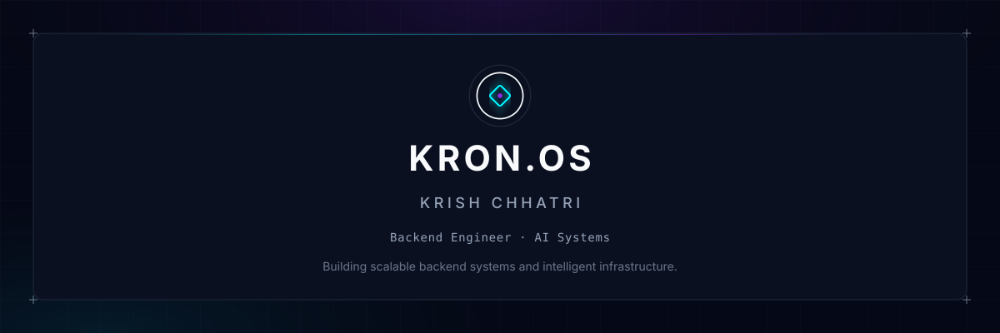

<!-- KRON.OS DASHBOARD -->
<table width="100%" cellspacing="0" cellpadding="0" style="border-collapse: collapse; background-color: #050816; border: 1px solid rgba(148,163,184,0.15);">

<!-- HERO -->
<tr>
<td style="padding: 0; border-bottom: 1px solid rgba(148,163,184,0.15);">

</td>
</tr>

<!-- SYSTEM STATUS BAR -->
<tr>
<td bgcolor="#080D1C" align="center" style="padding: 15px; border-bottom: 1px solid rgba(148,163,184,0.15);">
<b style="color: #00F5FF; font-family: monospace; font-size: 16px;">KRON.OS // SYSTEM ONLINE</b> 
• BACKEND ENGINEERING &nbsp;&nbsp;&nbsp;&nbsp; • AI SYSTEMS &nbsp;&nbsp;&nbsp;&nbsp; • INFRASTRUCTURE
</td>
</tr>

<!-- ABOUT -->
<tr>
<td bgcolor="#050816" align="center" style="padding: 30px; border-bottom: 1px solid rgba(148,163,184,0.15);">

Backend engineer focused on building scalable APIs, AI-powered systems,
and production-oriented infrastructure.  
I enjoy turning complex problems into modular systems — from agentic AI
and real-time applications to backend services, automation, and secure
data workflows.

</td>
</tr>

<!-- FEATURED WORK: AEGIS ORIGINATE -->
<tr>
<td bgcolor="#080D1C" align="center" style="padding: 30px; border-bottom: 1px solid rgba(148,163,184,0.15);">
<h2 style="color: #F8FAFC; margin-bottom: 5px;">AEGIS ORIGINATE</h2>
<b style="color: #00F5FF; font-family: monospace; font-size: 14px;">Agentic Video Loan Origination</b>

Autonomous AI loan origination over WebRTC with conversational AI,
liveness verification, age verification, and real-time offer generation.

<code>Next.js</code> <code>LiveKit</code> <code>Python</code> <code>Gemini Live</code> <code>MiniFASNet</code> <code>DeepFace</code> <code>Supabase</code>

 
<a href="https://github.com/krishch1/Aegis-Originate---Agentic-Video-Loan-Origination"><b style="color: #8A2BE2; font-family: monospace; font-size: 14px;">VIEW PROJECT →</b></a>
</td>
</tr>

<!-- FEATURED WORK: VERITAS & BEACON -->
<tr>
<td style="padding: 0; border-bottom: 1px solid rgba(148,163,184,0.15);">
  <table width="100%" cellspacing="0" cellpadding="0" style="border-collapse: collapse;">
    <tr>
      <td bgcolor="#050816" width="50%" align="center" valign="top" style="padding: 30px; border-right: 1px solid rgba(148,163,184,0.15);">
        <h3 style="color: #F8FAFC; margin-bottom: 5px;">VERITAS</h3>
        <b style="color: #00F5FF; font-family: monospace; font-size: 12px;">AI-Powered Document Forgery Detection</b>
        

        AI-powered certificate verification combining OCR, ResNet-based forgery
        detection, digital signatures, and QR-based verification.
        

        

        <code>Python</code> <code>FastAPI</code> <code>ResNet</code> <code>OCR</code> <code>Docker</code>
        

         
        <a href="https://github.com/krishch1/VERITAS"><b style="color: #8A2BE2; font-family: monospace; font-size: 13px;">VIEW PROJECT →</b></a>
      </td>
      <td bgcolor="#050816" width="50%" align="center" valign="top" style="padding: 30px;">
        <h3 style="color: #F8FAFC; margin-bottom: 5px;">BEACON</h3>
        <b style="color: #00F5FF; font-family: monospace; font-size: 12px;">Student Risk Analysis Dashboard</b>
        

        Proactive student-risk analysis using CSV ingestion, rule-based analysis,
        PostgreSQL, and an interactive React dashboard.
        

        

        <code>Python</code> <code>FastAPI</code> <code>React</code> <code>PostgreSQL</code> <code>Docker</code>
        

         
        <a href="https://github.com/krishch1/BEACON-25"><b style="color: #8A2BE2; font-family: monospace; font-size: 13px;">VIEW PROJECT →</b></a>
      </td>
    </tr>
  </table>
</td>
</tr>

<!-- FEATURED WORK: OBLIVION -->
<tr>
<td bgcolor="#080D1C" align="center" style="padding: 30px; border-bottom: 1px solid rgba(148,163,184,0.15);">
<h3 style="color: #F8FAFC; margin-bottom: 5px;">OBLIVION</h3>
<b style="color: #00F5FF; font-family: monospace; font-size: 12px;">Certified Data Sanitization</b>

Secure data sanitization with multi-pass wiping, SHA256 verification,
and cryptographically signed Wipe Certificates.

<code>Python</code> <code>FastAPI</code> <code>Bash</code> <code>ECDSA</code> <code>SHA256</code> <code>Docker</code>

 
<a href="https://github.com/krishch1/OBLIVION-25"><b style="color: #8A2BE2; font-family: monospace; font-size: 13px;">VIEW PROJECT →</b></a>
</td>
</tr>

<!-- TECHNOLOGY HEADER -->
<tr>
<td bgcolor="#050816" align="center" style="padding: 15px; border-bottom: 1px solid rgba(148,163,184,0.15);">
<b style="color: #F8FAFC; font-family: monospace; font-size: 16px;">TECHNOLOGY</b>
</td>
</tr>

<!-- TECHNOLOGY BODY -->
<tr>
<td style="padding: 0; border-bottom: 1px solid rgba(148,163,184,0.15);">
  <table width="100%" cellspacing="0" cellpadding="0" style="border-collapse: collapse;">
    <!-- LANGUAGES -->
    <tr>
    <td bgcolor="#080D1C" width="30%" align="right" valign="middle" style="padding: 20px; border-right: 1px solid rgba(148,163,184,0.15); border-bottom: 1px solid rgba(148,163,184,0.15);">
    <b style="color: #00F5FF; font-family: monospace; font-size: 14px;">LANGUAGES</b>
    </td>
    <td bgcolor="#080D1C" width="70%" align="left" valign="middle" style="padding: 15px; border-bottom: 1px solid rgba(148,163,184,0.15);">
      <table cellspacing="0" cellpadding="0" style="border: none;"><tr>
        <td align="center" width="70" style="padding: 0;"> Python</td>
        <td align="center" width="70" style="padding: 0;"> JavaScript</td>
        <td align="center" width="70" style="padding: 0;"> Bash</td>
      </tr></table>
    </td>
    </tr>
    <!-- BACKEND -->
    <tr>
    <td bgcolor="#080D1C" width="30%" align="right" valign="middle" style="padding: 20px; border-right: 1px solid rgba(148,163,184,0.15); border-bottom: 1px solid rgba(148,163,184,0.15);">
    <b style="color: #8A2BE2; font-family: monospace; font-size: 14px;">BACKEND</b>
    </td>
    <td bgcolor="#080D1C" width="70%" align="left" valign="middle" style="padding: 15px; border-bottom: 1px solid rgba(148,163,184,0.15);">
      <table cellspacing="0" cellpadding="0" style="border: none;"><tr>
        <td align="center" width="70" style="padding: 0;"> FastAPI</td>
        <td align="center" width="70" style="padding: 0;"> Node.js</td>
        <td align="center" width="70" style="padding: 0;"> Next.js</td>
      </tr></table>
    </td>
    </tr>
    <!-- AI / ML -->
    <tr>
    <td bgcolor="#080D1C" width="30%" align="right" valign="middle" style="padding: 20px; border-right: 1px solid rgba(148,163,184,0.15); border-bottom: 1px solid rgba(148,163,184,0.15);">
    <b style="color: #00F5FF; font-family: monospace; font-size: 14px;">AI / ML</b>
    </td>
    <td bgcolor="#080D1C" width="70%" align="left" valign="middle" style="padding: 15px; border-bottom: 1px solid rgba(148,163,184,0.15);">
      <table cellspacing="0" cellpadding="0" style="border: none;"><tr>
        <td align="center" width="80" style="padding: 0;"> Gemini Live</td>
        <td align="center" width="70" style="padding: 0;"> ResNet</td>
        <td align="center" width="75" style="padding: 0;"> MiniFASNet</td>
        <td align="center" width="70" style="padding: 0;"> DeepFace</td>
        <td align="center" width="70" style="padding: 0;"> OCR</td>
      </tr></table>
    </td>
    </tr>
    <!-- DATABASES & STATE -->
    <tr>
    <td bgcolor="#080D1C" width="30%" align="right" valign="middle" style="padding: 20px; border-right: 1px solid rgba(148,163,184,0.15); border-bottom: 1px solid rgba(148,163,184,0.15);">
    <b style="color: #8A2BE2; font-family: monospace; font-size: 14px;">DATABASES & STATE</b>
    </td>
    <td bgcolor="#080D1C" width="70%" align="left" valign="middle" style="padding: 15px; border-bottom: 1px solid rgba(148,163,184,0.15);">
      <table cellspacing="0" cellpadding="0" style="border: none;"><tr>
        <td align="center" width="80" style="padding: 0;"> PostgreSQL</td>
        <td align="center" width="70" style="padding: 0;"> Supabase</td>
      </tr></table>
    </td>
    </tr>
    <!-- INFRASTRUCTURE -->
    <tr>
    <td bgcolor="#080D1C" width="30%" align="right" valign="middle" style="padding: 20px; border-right: 1px solid rgba(148,163,184,0.15); border-bottom: 1px solid rgba(148,163,184,0.15);">
    <b style="color: #00F5FF; font-family: monospace; font-size: 14px;">INFRASTRUCTURE</b>
    </td>
    <td bgcolor="#080D1C" width="70%" align="left" valign="middle" style="padding: 15px; border-bottom: 1px solid rgba(148,163,184,0.15);">
      <table cellspacing="0" cellpadding="0" style="border: none;"><tr>
        <td align="center" width="70" style="padding: 0;"> Docker</td>
        <td align="center" width="75" style="padding: 0;"> Compose</td>
        <td align="center" width="70" style="padding: 0;"> LiveKit</td>
      </tr></table>
    </td>
    </tr>
    <!-- SECURITY & CRYPTOGRAPHY -->
    <tr>
    <td bgcolor="#080D1C" width="30%" align="right" valign="middle" style="padding: 20px; border-right: 1px solid rgba(148,163,184,0.15); border-bottom: 1px solid rgba(148,163,184,0.15);">
    <b style="color: #8A2BE2; font-family: monospace; font-size: 14px;">SECURITY & CRYPTOGRAPHY</b>
    </td>
    <td bgcolor="#080D1C" width="70%" align="left" valign="middle" style="padding: 15px; border-bottom: 1px solid rgba(148,163,184,0.15);">
      <table cellspacing="0" cellpadding="0" style="border: none;"><tr>
        <td align="center" width="70" style="padding: 0;"> ECDSA</td>
        <td align="center" width="70" style="padding: 0;"> SHA256</td>
      </tr></table>
    </td>
    </tr>
    <!-- TOOLS -->
    <tr>
    <td bgcolor="#080D1C" width="30%" align="right" valign="middle" style="padding: 20px; border-right: 1px solid rgba(148,163,184,0.15);">
    <b style="color: #00F5FF; font-family: monospace; font-size: 14px;">TOOLS</b>
    </td>
    <td bgcolor="#080D1C" width="70%" align="left" valign="middle" style="padding: 15px;">
      <table cellspacing="0" cellpadding="0" style="border: none;"><tr>
        <td align="center" width="70" style="padding: 0;"> Git</td>
        <td align="center" width="70" style="padding: 0;"> Git LFS</td>
      </tr></table>
    </td>
    </tr>
  </table>
</td>
</tr>

<!-- GITHUB ACTIVITY -->
<tr>
<td bgcolor="#050816" align="center" style="padding: 30px; border-bottom: 1px solid rgba(148,163,184,0.15);">

  
<a href="https://github.com/krishch1"><b style="color: #00F5FF; font-family: monospace; font-size: 14px;">VIEW GITHUB PROFILE →</b></a>
</td>
</tr>

<!-- CURRENT FOCUS -->
<tr>
<td bgcolor="#080D1C" align="center" style="padding: 30px; border-bottom: 1px solid rgba(148,163,184,0.15);">
<b style="color: #F8FAFC; font-size: 15px;">Building</b> 
Autonomous AI systems · Backend infrastructure · Agentic workflows
  
<b style="color: #F8FAFC; font-size: 15px;">Exploring</b> 
System design · Distributed systems · Production-ready AI
</td>
</tr>

<!-- CONNECT & FOOTER -->
<tr>
<td bgcolor="#050816" align="center" style="padding: 30px;">
<a href="https://github.com/krishch1" style="color: #94A3B8; text-decoration: none;">GitHub</a> &nbsp;·&nbsp;
<a href="https://www.linkedin.com/in/krish-chhatri-4421a2384" style="color: #94A3B8; text-decoration: none;">LinkedIn</a> &nbsp;·&nbsp;
<a href="mailto:chhatrikrish@gmail.com" style="color: #94A3B8; text-decoration: none;">Email</a>
  
KRON.OS · Krish Chhatri
</td>
</tr>

</table>